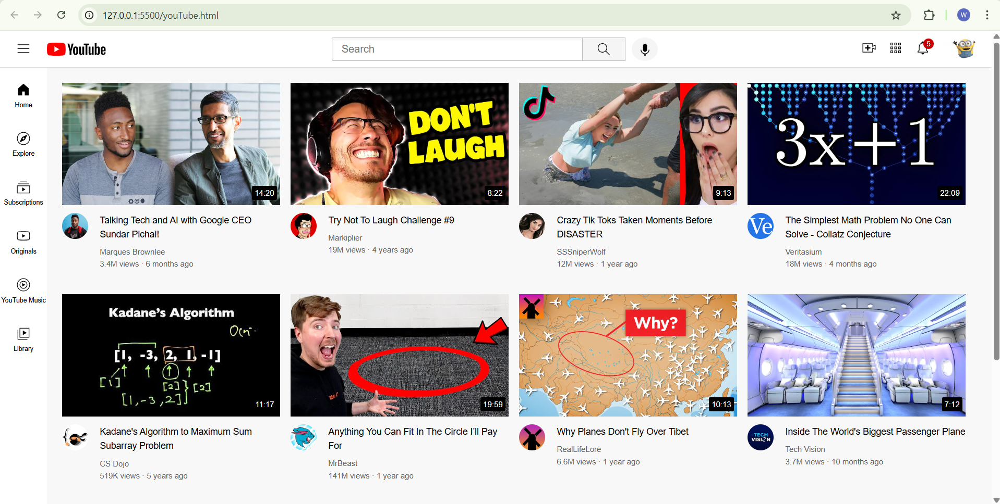

# 🎬 YouTube Clone

A simple **YouTube Clone** built using **HTML** and **CSS**, designed to replicate the look and feel of YouTube’s user interface. This project focuses on responsive design, layout structuring, and styling fundamentals using only front-end technologies.

---

## 🚀 Features

- 🎨 Responsive and clean user interface  
- 🧱 Structured layout with sidebar, header, and video grid  
- 🔍 Search bar for UI simulation  
- 📺 Video thumbnail grid with titles and channel info  
- 📱 Fully responsive design for various screen sizes  

---

## 🛠️ Technologies Used

- **HTML5** – for structure  
- **CSS3** – for styling and layout  

---

## 📂 Project Structure

```
youtube-clone/
│
├── index.html # Main HTML file
├── style.css # CSS file for styling
└── assets/ # (Optional) Images, thumbnails, icons
```


---

## 🧠 What I Learned

- Building a complex layout using **flexbox** and **grid**  
- Managing spacing, alignment, and responsive design  
- Creating a **clone UI** from a real-world website  
- Enhancing understanding of **modern CSS practices**

---

## 🖼️ Project Preview



---

## ⚙️ How to Run

1. Clone the repository:
   ```bash
   git clone https://github.com/Wajeehathabbu2206/YouTubeClone.git
   
2.Navigate into the project directory:
```bash
   Copy code
   cd YouTubeClone
   Open index.html in your browser.
```

---

### 🧑‍💻 Author
- Wajeeha
- 🔗 [GitHub Profile](https://github.com/Wajeehathabbu2206)

---
